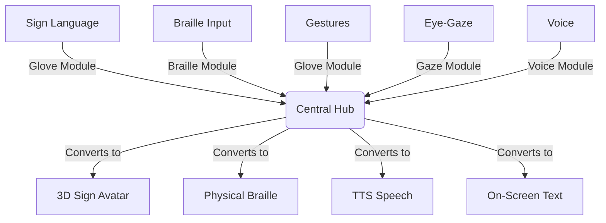

# Project Ability: Cross-Disability Communication Ecosystem 🌐

**Project Ability** is a research-level, microprocessor-based communication ecosystem designed to break down barriers between individuals with different types of disabilities. 

It functions as a **universal translator for human interaction**. Each user interacts using the modality most natural to them (Sign Language, Braille, Eye-Gaze, Voice), and the system automatically translates their input into the output format required by the receiver (3D Avatar, Physical Braille Pins, Synthesized Speech, On-Screen Text).

---

## 🌟 The Core Principle: "Everyone Talks to Everyone"

Instead of building 30 different devices to solve 30 different communication barriers, Project Ability uses a **Modular Hub-and-Spoke Architecture**:
- Each user owns a cheap, personal **Module** tailored to their specific disability.
- All modules connect to a shared **Central Hub**.
- The Central Hub acts as the translation engine, routing and converting messages seamlessly.

---

## 🧩 The Modular Ecosystem

### 1. The Central Hub (The Brain)
* **Hardware:** Raspberry Pi 5 (8GB)
* **Role:** Local MQTT broker, data router, format converter, and STT/TTS engine. 
* **Note:** The Hub has no camera, microphone, or Braille pins. It is a pure processing unit that ensures local privacy and low latency.

### 2. The Glove Module (Deaf / Mute Users)
* **Hardware:** ESP32-S3 + RPi Zero 2W + Camera + Flex Sensors + IMU
* **Input:** Sign Language & Gestures
* **Output:** 3D Sign Language Avatar (Screen)
* **Innovation:** Uses **Hybrid ML Fusion** (MediaPipe Holistic + Sensor Data via Bi-LSTM) to accurately translate complex signs locally.

### 3. The Braille Module (Blind / Low Vision Users)
* **Hardware:** ESP32-S3 + 6 Buttons + 2 Servo Motors + Speaker
* **Input:** 6-key Braille typing (Perkins layout)
* **Output:** Physical Braille dots + TTS Audio
* **Innovation:** Uses a novel **2-Servo Rack-and-Pinion Cam Mechanism** to drive Braille pins, replacing expensive and noisy electromagnetic solenoids.

### 4. The Gaze Module (Paralyzed / Parkinson's Users)
* **Hardware:** RPi Zero 2W + NoIR Camera + IR Ring + Screen + Speaker
* **Input:** Eye-Gaze Tracking & Blink Detection
* **Output:** Text on Screen + TTS Audio
* **Innovation:** Employs **MediaPipe Iris** for precise pupil tracking without expensive commercial eye-trackers. Features tremor-filtering for Parkinson's users.

### 5. The Voice Module (Hearing / Sighted Users)
* **Hardware:** ESP32-S3 + I2S Microphone + I2S Speaker
* **Input:** Voice
* **Output:** Synthesized Speech
* **Role:** Bridges the gap between the disabled community and the general public.

## 📁 Repository Structure

The active development files are located in the `CodeBase/` directory.

- **`CodeBase/`** — Source code for all modules and the Central Hub
  - **`modules/`** — Firmware and edge-ML code for the 4 module types
  - **`hub/`** — Python applications for the Central Hub routing and translation
  - **`ml/`** — Model training, datasets, and evaluation scripts
  - **`shared/`** — Cross-platform utilities (AMP Protocol, Crypto, Braille logic)
  - **`docs/`** — Hardware wiring, API references, and research paper drafts

*For detailed architectural documentation and hardware requirements, see `plan/MASTER_PLAN.md`.*

---

## 🛠️ Getting Started

1. Navigate to the `CodeBase/` directory.
2. Read the `README.md` in `CodeBase/` for specific setup scripts.
3. Review `CodeBase/requirements.txt` for Python dependencies.

*(Detailed build and bring-up instructions are currently being documented in the `docs/hardware/` folder).*
