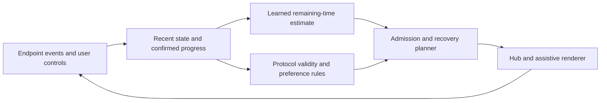

# Can AI/ML strengthen AMP's research contribution?

**Assessment date:** 15 September 2026  
**Target:** IEEE Internet of Things Journal  
**User-confirmed starting point:** Working devices, but no structured dataset yet.  
**Status:** Research recommendation. No model has been trained, no improvement measured, and no new algorithm established by this document.

## 1. Recommendation

**Yes, AI/ML could strengthen AMP, but only if it solves a measured decision problem that conventional methods handle poorly.** Adding a Transformer, LSTM, reinforcement-learning agent or LLM does not by itself change the earlier “mostly integration” novelty verdict.

For the current protocol-focused paper, the best candidate to investigate is:

> **Learning the uncertainty in receiver presentation/acknowledgment time, and using it in admission and recovery decisions for heterogeneous assistive endpoints.**

Start with a small supervised prediction model and an explicit controller. The initial model should predict an observable outcome, such as time to a defined renderer event or the user's next-chunk action. The protocol must continue to determine valid acknowledgment, order, expiry, consent and recovery states independently of the prediction.

**Do not commit to this direction before a feasibility pilot.** A receiver-controlled queue may already solve the practical problem. If service times are predictable constants, traffic is light, or each user has only one viable output, there may be little useful decision space for ML. Under those conditions, a recognition-focused research question may offer more opportunity, though it changes the paper's emphasis.

My judgment is therefore **conditional recommendation**, not “AI makes AMP Q1-ready.” The first contribution to establish is a useful, learnable and actionable problem.

## 2. What the current project supports

The existing [AMP schema](../../CodeBase/shared/protocol/amp_schema.json) carries IDs, profile labels, text content, language, timestamps and transport-related fields. It does not define model inputs, calibrated uncertainty, a training target, presentation-progress events or a learned decision policy. The previous [project audit](../PROJECT_ANALYSIS_AND_PUBLICATION_STRATEGY.md) found ML/hub implementation plans but no locally available training dataset, weights or evaluation records.

Your confirmation that the devices work is valuable: it makes real instrumentation possible. It does not establish that a suitable ML dataset already exists. For research, the deployed code and configurations must also be associated with the recorded data.

Profile names in the current schema are not a sufficient user model. Functional information—selected output, language, explicit preferences, recent observed response times and device state—is more useful for the proposed decision. Do not infer ability or preferred communication from a diagnosis category.

## 3. The feasibility gate: when would learning actually help?

Proceed with a learned protocol controller only if these questions have evidence-backed answers:

| Gate | Evidence needed | If the answer is no |
|---|---|---|
| Does a simple baseline have a material problem? | Unexpected backlog, avoidable repair, missed deadlines or resource contention under representative workloads | Do not add ML merely to improve a negligible metric |
| Is there predictable variation? | Observable history/context predicts future service or acknowledgment time beyond a constant, moving average or simple state estimator | A larger network will not manufacture information |
| Can the system take a useful action? | Admission, prefetch, batching, shared-resource allocation or an approved alternative actually changes the outcome | Prediction alone may be scientifically uninteresting |
| Does the action preserve user control? | Users can retain manual progression, reject fallback and override timing | Redesign the controller before evaluation |
| Does the benefit survive realistic costs? | Improvement after accounting for inference, logging, calibration and user interaction | Prefer the simpler policy |

**A central limitation:** if one fixed-speed renderer presents an ordered queue and cannot change its service rate, ML cannot make the person read faster. Delaying admission can merely move the queue from receiver to sender. Measure the whole conversation and both queues, otherwise an apparent latency improvement may be accounting rather than improvement.

Similarly, small text messages may not create a meaningful network bottleneck. Demonstrate the actual constrained resource—renderer, user input, inference, shared hub, storage or network—instead of assuming IoT implies congestion. If a disconnected link has no predictive signal, report the uncertainty rather than claiming to predict its return.

## 4. Ranking the AI/ML directions

This ranking reflects **fit to the current protocol paper and your no-dataset starting point**, not a claim that any row is novel.

| Direction | Candidate methods | Where research value might lie | Main threat / burden | Recommendation |
|---|---|---|---|---|
| **A. Receiver-time prediction and constrained control** | Quantile regression; boosted trees; small temporal model if justified; explicit controller | Decisions that account for uncertain, partly completed presentation and changing observed service times | Predictive control is established; simple feedback may suffice | **First feasibility study for AMP** |
| **B. Conversion-confidence-aware communication and repair** | Calibrated classifiers; selective prediction; learned cost estimates | Decide when to request confirmation or use an approved conversion path before expensive output | Calibration and rejection are established; requires labeled intended messages and realistic errors | Strong alternative if conversion errors dominate |
| **C. Robust glove–camera fusion** | Causal temporal encoders, learned reliability weighting, missing-modality training | Generalization under occlusion, missing streams, misalignment and unseen signers | Multimodal sign recognition already exists; substantial synchronized dataset needed | Viable separate sensing/ML paper; potential IoTJ fit if distributed constraints are central |
| **D. Learned modality selection** | Contextual bandit for genuinely one-step choices; constrained sequential policy where effects persist | Personalization among multiple valid, user-approved alternatives | Prior systems already learn preferences; many users may have no interchangeable modality | Optional only after verifying action diversity |
| **E. LLM-assisted gaze/text input** | User-selected completion or abbreviation expansion | Reduce actual input/repair effort for a specific underserved setting | SpeakFaster and earlier AAC prediction are close prior art; human evaluation essential | Useful product feature, weak primary protocol novelty |
| **F. Deep RL for all scheduling/recovery** | Constrained actor–critic or model-based RL | Long-horizon decisions where simpler controllers provably or empirically struggle | Simulator validity, data demand, delayed feedback, reward shortcuts and baseline strength | **Do not start here** |
| **G. Semantic compression / federated learning / GNN by default** | Depends on a separately defined problem | Potentially valuable only with a demonstrated semantic, distributed-training or graph decision problem | Easily adds components without solving the measured bottleneck | Defer until the problem requires it |

Do not build A–G together. Pick one primary mechanism, hold the rest constant, and identify its contribution through controlled comparisons.

## 5. What prior AI/ML work already covers

The following primary sources were checked during this assessment. This is a targeted extension of the earlier review, not an exhaustive ML novelty search. Full-text evidence is distinguished from abstracts in the [evidence notes](AI_ML_EVIDENCE.md).

| Verified source | Relevant prior capability | Consequence for AMP |
|---|---|---|
| [Fugu: Learning in situ, NSDI 2020](https://www.usenix.org/conference/nsdi20/presentation/yan) | Learns a probability distribution of transmission time and uses it in model predictive control; examines deployment rather than relying only on simulation | “Neural prediction plus controller” is already established. This is a mandatory methodological comparator. |
| [Decima, SIGCOMM 2019](https://researchportal.hkust.edu.hk/en/publications/learning-scheduling-algorithms-for-data-processing-clusters/) | Reinforcement learning for workload-specific scheduling | Applying RL to a queue does not establish a new learning method. |
| [Adaptive Modality Selection, IROS 2018](https://www.iri.upc.edu/groups/perception/AMSAlgorithm/) | Selects modalities using user/environment state and learned preferences | “AI chooses the best modality for the user” is too broad a novelty claim. |
| [Sign Language Recognition with Multimodal Sensors and Deep Learning Methods, 2023](https://www.mdpi.com/2079-9292/12/23/4827) | Bending-sensor information and visual keypoints with CNN/BiLSTM processing | Glove + camera + deep network substantially overlaps prior work. |
| [SIGMA-ASL, 2026 preprint](https://arxiv.org/abs/2605.06351) | Synchronized RGB-D, radar and IMU dataset with user-dependent/independent benchmarks | A multimodal dataset needs a specific missing contribution; this source is explicitly a preprint. Its sensor suite is not a direct match to your glove. |
| [SpeakFaster, Nature Communications 2024](https://www.nature.com/articles/s41467-024-53873-3) | LLM-assisted abbreviated text entry with gaze AAC evaluation | Adding LLM prediction to gaze input is not a new application category. |
| [Conformalized Quantile Regression, NeurIPS 2019](https://proceedings.neurips.cc/paper/2019/hash/5103c3584b063c431bd1268e9b5e76fb-Abstract.html) | Prediction intervals built around quantile regression | Uncertainty estimation is a reusable method, not AMP's invention. |
| [Adaptive Conformal Inference, NeurIPS 2021](https://proceedings.neurips.cc/paper/2021/hash/0d441de75945e5acbc865406fc9a2559-Abstract.html) | Adapts prediction coverage over changing sequences | Distribution shift has existing methods; do not claim a universal per-user guarantee. |
| [On Calibration of Modern Neural Networks, ICML 2017](https://proceedings.mlr.press/v70/guo17a.html) | Studies confidence calibration and temperature scaling | A model's raw score cannot simply be labeled probability of correct communication. |

The conclusion is deliberately demanding: **none of these model families is a ready-made novelty claim for AMP.** The candidate contribution is a specific decision formulation, mechanism and demonstrated outcome at the assistive presentation/recovery boundary.

## 6. Recommended candidate: uncertainty-aware receiver modeling

### 6.1 The problem in plain language

A hub should know whether it is about to give a receiver more work than the receiver can comfortably handle. Recent activity might reveal that the receiver now needs longer between chunks. After an interruption, some work is complete, some remains, and some may be uncertain. A useful learned estimate would inform buffering or scheduling while the receiver retains control of presentation.

**Illustrative scenario, not a reported experiment:** a user advances Braille chunks manually. The next chunk requires a hub conversion, and the network intermittently stalls. AMP could learn how much lead time to allow for preparation while bounding queued work. On reconnection, it uses confirmed progress to avoid preparing/replaying already completed content. Whether this beats a fixed prefetch window is the research question.

### 6.2 Define the target before selecting the model

There are at least three distinct targets:

1. **Renderer service time:** command/start to the specified device completion event.
2. **User progression time:** display availability to an explicit next/confirm action.
3. **Comprehension outcome:** whether the participant understood the message in a study task.

Do not merge them. A servo movement duration can be nearly deterministic while user progression varies. A next action is an observable behavior, but not proof of comprehension. None of these should be called “disability detection” or “fatigue detection” without an independently validated target and corresponding study.

For the first model, choose one well-defined observable target. A useful candidate is the distribution of **remaining time to the next required endpoint/user acknowledgment**, conditioned on the evidence currently available. Define what that acknowledgment means for every tested renderer.

### 6.3 Inputs available at decision time

Candidate features include remaining segment count; language and output encoding; chosen renderer; elapsed time in the current state; explicit progression mode; recent observed completion/next-action intervals; current pause state; queue work; recent measured link behavior; renderer errors; progress checkpoint; and the candidate action.

Use a pseudonymous participant key only for an explicitly evaluated personalization regime. Start from functional signals, not diagnosis categories. Message-length and encoding features may suffice initially; text embeddings should only be added if they offer a measured benefit that justifies content processing.

**No future leakage:** the features for a decision cannot include its eventual completion timestamp, a later confirmation or a network statistic calculated after that decision. A bidirectional temporal model must not consume future events when the claim is online prediction.

### 6.4 Outputs

Estimate a central and an upper conditional quantile of the remaining time. In plain language: predict a typical duration and a longer duration that reflects uncertainty. Quantile levels are design choices to validate; they are not experimentally supported parameters yet.

Only add a separate repair/error-probability model when reliable labels exist. Do not train “probability the user understood” from receipt or renderer-complete events.

Conformal calibration is an optional wrapper. Standard split conformalized quantile regression's coverage theorem assumes exchangeability; correlated sessions, personalization and policy changes require care. Adaptive conformal inference addresses a different long-run coverage objective and does not automatically guarantee each user, each action or each deadline. These qualifications follow the respective [CQR theorem](https://proceedings.neurips.cc/paper/8613-conformalized-quantile-regression.pdf) and [ACI formulation](https://proceedings.neurips.cc/paper/2021/hash/0d441de75945e5acbc865406fc9a2559-Abstract.html).

### 6.5 Controller and permitted actions

Use an explicit controller that evaluates a small set of permitted actions: admit another semantic chunk, wait, precompute/prefetch within a bounded buffer, allocate a shared conversion resource, or request an approved recovery/fallback interaction. Only test route selection when multiple acceptable routes actually exist.

Model predictive control means repeatedly planning a short distance ahead, taking the next action, and updating the plan when new feedback arrives. The exact horizon and cost weights require tuning on development data. An initial cost can combine waiting, avoidable repair and resource use, with a declared fairness policy across conversations.

Keep hard rules outside optimization: finite storage, message order, explicit pause, approved modalities, content-version matching and admissible progress transitions. An estimated probability must not authorize a forbidden route or turn uncertain physical presentation into a confirmed ACK. A sum of per-chunk upper quantiles is not automatically a calibrated upper bound on a whole conversation's duration.

This is a proposed architecture. The learning module estimates uncertain costs; the protocol supplies the meaning of events and allowable transitions.

### 6.6 What might actually be original?

The contribution would have to be more specific than “predict presentation time.” A candidate is an **action-conditioned model and controller that account for confirmed versus uncertain progress when choosing admission and recovery actions**, particularly when a resumed or changed output has a different remaining workload.

To make that scientifically meaningful, demonstrate a case where independent recovery plus ordinary adaptive credit performs poorly, explain the mechanism causing that failure, and show that the proposed coordination resolves it under fair conditions. Simply adding progress as another feature to a standard regressor is not sufficient evidence of algorithmic novelty.

The learned part could be a standard model in an original systems contribution. A new neural architecture is not mandatory for this positioning. Conversely, if the entire method is standard prediction plus standard control with no distinctive result, it remains an integration contribution even when the prediction error is low.

## 7. Which model should you actually start with?

| Stage / model | Purpose | Promotion criterion |
|---|---|---|
| Deterministic length/rate estimate, per-renderer lookup, recent moving average | Establish what requires no substantial learning | Always retain as baselines |
| Linear/quantile regression and a simple state estimator | Test whether context/history adds predictable information | Outperform simple estimates on future sessions, not random neighboring rows |
| **Quantile gradient-boosted trees** | First practical nonlinear candidate for tabular event/context features | Better calibration/accuracy and an actual controller benefit at acceptable cost |
| Small causal GRU or temporal convolutional model | Capture useful history not represented by summary statistics | History ablation shows a benefit that survives unseen sessions/users |
| Hierarchical/personalized update | Adapt a population model with limited per-user observations | Cold-start and post-adaptation performance are separately strong |
| Contextual bandit / RL | Learn action choice if the above controller is demonstrably inadequate | Valid interaction model, enough representative action data, and superiority to model-based control |

The named tree family is a starting candidate, not a conclusion that it will win. Use an implementation with the required quantile objective and verify its current API before coding. [LightGBM's original paper](https://proceedings.nips.cc/paper/2017/hash/6449f44a102fde848669bdd9eb6b76fa-Abstract.html) is a reference for the established boosting framework, not evidence of AMP performance.

**My recommendation today:** begin with the simple baselines and quantile boosted trees on the Raspberry Pi/hub. Train offline initially; benchmark actual hub latency and memory. Consider a small causal sequence model only if the collected data shows a need. Do not select PPO, a Transformer or federated learning as the starting architecture just for publication appeal.

## 8. A second candidate if conversion errors dominate

An input recognizer can produce a plausible but wrong message. Delivering it reliably does not repair the error. A confidence-aware pipeline could decide when to request sender confirmation before committing a costly tactile or speech presentation.

Possible actions include presenting a candidate for confirmation, retaining an exact typed input, or using another already approved recognizer/route. A calibrated classification model estimates a defined error event; a cost model accounts for confirmation effort and expected downstream repair. Calibration itself is established [Guo et al., ICML 2017](https://proceedings.mlr.press/v70/guo17a.html).

The useful research question would be whether **conversion uncertainty plus downstream presentation/repair cost** improves correct communication with acceptable confirmation burden, compared with a fixed confidence threshold, calibrated selective prediction and a conventional cost-sensitive policy. A rule such as “confidence below a threshold means ask again” is a necessary baseline, not a sufficient new method.

This route requires intended-message labels, realistic recognizer mistakes, evidence of user confirmation cost, and held-out speakers/signers. If only known typed messages exist, you cannot demonstrate improved recognition uncertainty from those traces. Do not manufacture a classifier's error distribution and then claim validation on actual users.

## 9. When a new recognition model is the better paper

If the actual bottleneck is poor glove/camera recognition under occlusion or sensor dropout, investigate that directly. A candidate design is causal sensor/vision temporal encoding with reliability-aware fusion, accompanied by missing-modality and timestamp-misalignment training.

The meaningful test is generalization across signers, sessions and realistic corruptions. Compare each single modality, concatenation, late fusion, established attention/gating and the proposed method. Distinguish isolated gestures, fingerspelling and full sign-language translation. A held-out signer split is essential for a signer-independent claim; neighboring frames from one performance cannot be split across train and test.

There is substantial overlap already: [the 2023 sensor/vision recognition paper](https://www.mdpi.com/2079-9292/12/23/4827) and [SIGMA-ASL's 2026 preprint](https://arxiv.org/abs/2605.06351) both undermine a generic multimodal-fusion claim. Your sensors and language may differ, but “new hardware combination” or “different local vocabulary” alone does not demonstrate a new learning principle.

This could become a stronger ML study than receiver scheduling if the latter has no actionable uncertainty. For IEEE IoTJ, explicitly connect the model to distributed sensing, missing/delayed streams and measured edge/network constraints. If the contribution is chiefly recognition accuracy, reassess venue fit rather than forcing it into the AMP protocol paper.

## 10. Why an LLM is not my first recommendation

LLM-assisted AAC is already supported by direct prior work. SpeakFaster provides abbreviation expansion and user-selected candidates for gaze typing [Nature Communications, 2024](https://www.nature.com/articles/s41467-024-53873-3). Adding a general language model to your gaze module would therefore be an application implementation unless a more specific unmet problem is established.

An LLM could still be useful for user-approved suggestions or a separately evaluated language-specific input method. Measure correction burden, exact intended-message preservation and user agency. A generated paraphrase or summary can change what a person meant; it cannot silently replace the original message to make the network benchmark look faster. BLEU or embedding similarity alone does not establish successful interpersonal communication.

Likewise, calling text conversion “semantic communication” does not establish a new semantic-channel model, coding method or task objective. Define what is transmitted, what information is lost, what the receiver must recover and what baseline is improved before using that framing.

## 11. Data collection plan for your actual starting point

### 11.1 First artifact: an event dataset

Create timestamped records with a stable schema, a protocol/device software version and enough provenance to reproduce the experiment. A suggested record includes:

| Group | Fields to record |
|---|---|
| Identity | Pseudonymous session/participant IDs where applicable; message, segment, route and presentation-epoch IDs |
| Event | Created, admitted, received, render-start, defined render-complete, user-next/confirm, pause/resume, disconnect/reconnect, expired/rejected, repair |
| Available state | Queue contents/work, confirmed/uncertain progress, elapsed time, approved output, current manual/automatic progression mode |
| Context | Renderer/firmware, language/encoding, message length, relevant device/network measurements available at that moment |
| Action | Action chosen, allowed alternatives, controller/model version, prediction and uncertainty, override reason |
| Outcome | Actual target event time or censoring status; repeated/omitted segments; explicit user correction/confirmation where available |
| Provenance | Hardware configuration, clock source/synchronization error, workload and fault-trace identifiers |

Do not log raw personal conversation content by default. Controlled message IDs and derived features can support many experiments. Collect identifiable or sensitive recordings only when necessary for the agreed study and with appropriate consent and handling.

### 11.2 Three different sources of data

- **Automated hardware traces:** useful for renderer timing, reconnects, queue control and resource measurement. These can establish system behavior, not human comprehension.
- **Controlled user sessions:** needed for actual progression, preferences, repairs and comprehension. Choose intended participants for the modalities claimed and obtain appropriate ethics review before recruitment.
- **Synthetic/emulated workloads:** useful for repeatable stress and algorithm development. Their role and assumptions must be disclosed; simulated user speed is not a validated human model.

Start by testing a diversity of message lengths, actual output configurations, user-controlled timing and interruptions. Collect enough independent sessions to estimate uncertainty and draw learning curves. There is no defensible universal number of rows or participants to prescribe before knowing variability and the study endpoint.

### 11.3 Avoid the most likely dataset errors

If a session ends before confirmation, time-to-confirm is **censored**, not zero and not necessarily a failure. Record the last observation and reason. Consider survival/time-to-event modeling if censoring is substantial; otherwise clearly scope analyses to observed outcomes and disclose selection bias.

The current policy affects which actions are observed. Logs containing only one action cannot establish that an untried alternative is better. Vary actions only within approved bounds and study design; retain action-selection probabilities if a valid randomized/off-policy evaluation will use them. A naive replay of action-dependent user outcomes is not a causal controller comparison.

Missing feedback does not imply that content was unread. A participant requesting repeat does not automatically identify a recognizer error. Define labels before training and distinguish logging failure, user choice, converter error and renderer fault.

## 12. Experimental design that can support an ML claim

### 12.1 Prediction evaluation

Split by time and session first; add held-out-user and held-out-device tests for those generalization claims. Fit preprocessing and tune parameters on training/development data only. Keep calibration data separate from the final test set. Evaluate cold-start separately from a predeclared adaptation period, and specify whether online updates are allowed during testing.

Measure median absolute error or MAE for point estimates, quantile loss, interval coverage and width, performance during drift, and breakdowns by relevant modality/session conditions. For confidence models, include reliability/calibration and the error-versus-confirmation tradeoff. Report uncertainty across independent sessions/users rather than treating all event rows as independent.

Prediction accuracy is not the final result. A better predictor can produce a worse controller if it becomes too conservative, increases sender waiting or frequently interrupts users.

### 12.2 Controller baselines

Retain the strong B2–B4 foundations from the [original protocol review](REVIEW.md#15-strong-baselines-and-ablations). On identical protocol semantics, compare:

1. Fixed user-controlled progression with a sensible bounded prefetch/credit policy.
2. Measured-service-time adaptive credit using a moving average or state estimator.
3. Explicit controller with an analytical or simple empirical time model.
4. The same controller with learned point estimates.
5. The same controller with learned uncertainty.
6. Learned uncertainty with and without progress/recovery conditioning.
7. Proposed joint mechanism versus an independently composed recovery-plus-control implementation.

A Fugu-inspired probabilistic-prediction/controller design is a relevant **adapted methodological baseline**, not a claim that Fugu's original video implementation supports Braille. Keep output content, valid actions, feedback signals, resource budget and tuning opportunities equal. Separate predictor benefit from a change in available information or protocol functionality.

An idealized future-information oracle can estimate performance headroom in a validated controlled environment; label it nondeployable. If it barely improves the simple baseline, further learning is unlikely to be worthwhile. Oracle results cannot substitute for real action-dependent user experiments.

### 12.3 System and human outcomes

Report generated/admitted/completed/expired/rejected/uncertain counts, creation-to-completion delay, both sender and receiver waiting, unwanted repeated/omitted content, time to recover, fairness and hub CPU/RAM/control/storage costs. Count explicit progress prompts and confirmations as workload, not free actions.

For intended-user studies, measure task success/comprehension and repair effort alongside autonomy and preference compliance. Compare one primary proposed method with the strongest practical baseline using a justified counterbalanced or alternative design. Define meaningful effects and sample-size reasoning after formative variability estimates. Do not promise a percentage improvement before measuring it.

### 12.4 Required stress and ablation conditions

Include constant versus changing service rate; ordinary versus burst traffic; no faults versus interrupted presentation; restart before/after durable progress logging; multiple conversations sharing resources; and approved route changes where the platform supports them. Test unobserved conditions and report graceful fallback to a valid conventional policy when uncertainty is large or the model is unavailable.

For the proposed mechanism, remove personalization, recent history, progress conditioning and uncertainty separately. These comparisons determine whether a sequence model or calibrated distribution is genuinely necessary. Also report clean/simple conditions where the conventional method may be equally good or better.

## 13. Research questions and contribution wording

**RQ1:** How predictable are renderer/user acknowledgment times from observable context and history, across sessions and supported output modalities?

**RQ2:** Does using this uncertainty together with confirmed/uncertain presentation progress improve admission and recovery outcomes over conventional feedback and a standard prediction-based controller?

**RQ3:** Do any system improvements reduce repair effort or waiting for intended users without reducing comprehension or control?

**A defensible proposed contribution statement:**

> AMP investigates a learning-assisted control mechanism for remote assistive communication in which presentation progress may be partial or uncertain. It estimates observable receiver completion dynamics and uses those estimates within explicit protocol and preference constraints. The study tests whether joint progress-aware prediction and control improve recovery and communication outcomes beyond analytical models, adaptive receiver credit and independently composed prediction/recovery methods.

This statement defines an investigation. A final manuscript must replace intentions with the mechanism, assumptions, baselines and results actually established. Do not claim a new learning architecture if the chosen estimator is an existing one.

**Possible working title if this direction succeeds:**

**AMP: Learning Receiver Dynamics for Presentation-Aware Control in Assistive IoT Communication**

If partial-recovery coordination is not demonstrated, remove that claim from the title and contribution list. If the only result is a useful predictor, assess whether that prediction problem alone is substantial enough for the chosen venue.

## 14. Publication judgment and decision sequence

IEEE IoTJ is a plausible target for a generalizable mechanism grounded in heterogeneous devices, edge constraints and communication-system evaluation; see its [official scope](https://ieee-iotj.org/). Merely including AI does not establish scope depth, Q1-quality evidence or acceptance.

| Observed outcome | Research judgment |
|---|---|
| Simple feedback solves the problem; ML adds little | Keep conventional AMP. Do not force an AI novelty claim. |
| Prediction improves, but communication does not | Useful modeling result, insufficient evidence for the claimed protocol advantage. |
| Standard ML + standard controller wins only against a weak baseline | Integration result; improve comparisons before asserting scientific novelty. |
| Joint progress/uncertainty mechanism wins against strong composed baselines, with explained limits | Potentially defensible systems contribution; IoTJ becomes more credible. |
| Robust fusion is the strongest measured result | Reframe the primary paper around sensing/learning, with AMP as infrastructure. |

**Immediate sequence:** instrument the devices → collect baseline sessions → identify the bottleneck and actionable uncertainty → estimate attainable headroom → fit simple and nonlinear predictors → test an explicit controller → evaluate with intended users for human claims → write the paper around the demonstrated contribution.

**Final recommendation:** Explore AI/ML, starting with a small receiver-dynamics study. Keep the broad novelty verdict provisional. With working devices and no dataset, your next research asset should be a well-defined event dataset and a strong conventional baseline. Those will tell us whether to pursue learning-assisted AMP or a more focused recognition problem.
